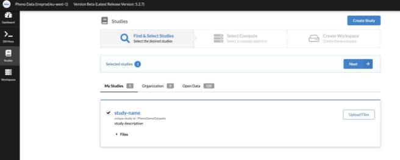
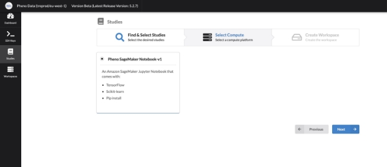
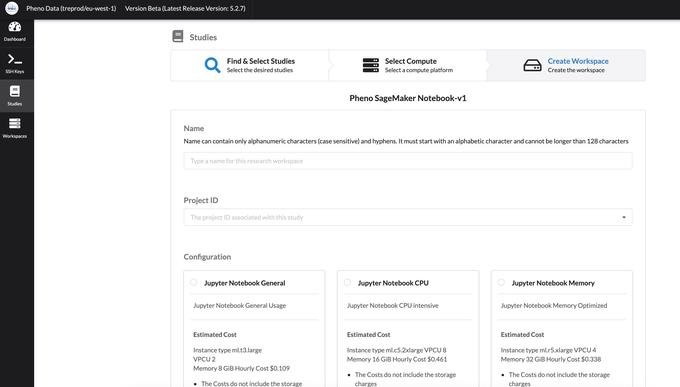
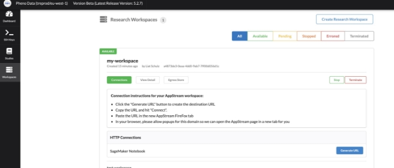
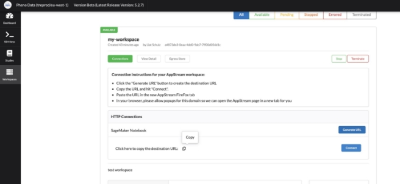
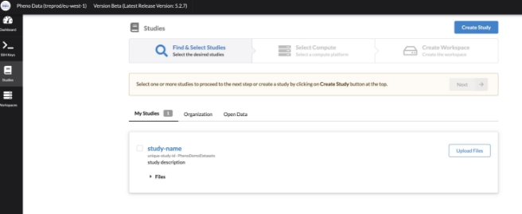
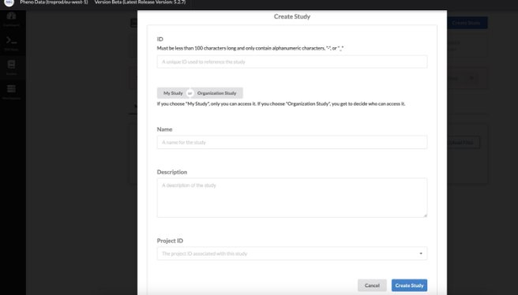

# Trusted Research Environment User Guide

Trusted Research Environment (TRE) is a cloud solution that provides secure access to data, tooling, and compute power that researchers need. Researchers can focus on achieving research missions and completing essential work in minutes in a trusted research environment.

# Getting Started

## Sign Up

Use this section if this is your first time connecting to the system.

1. Open your browser and navigate to the TRE URL.
1. Click on the **Sign up** link.

3. Fill out your **Username** (email address), **Name**, **Family name** and pick a **Password.**

4. Click the **Sign up** button.

## Login

1. Open your browser and navigate to the TRE URL.
1. Type in your **Username** (the email you used to sign up) and your **Password.**
1. Click the **Sign In** button.

## User Interface

**Dashboard** - Displays AWS charges over the past 30 days

**SSH Keys** - SSH Keys for EC2 authorization

**Studies** - Data sets saved in Amazon S3

**Workspaces** - The combination of a study with a compute

# Using Trusted Research Environment

## Launching a new Research Environment

A user can select a Study or multiple Studies and launch a Workspace to access and analyze data. To launch a Research Environment, follow these steps:

1. In the portal navigate to the **Studies** page using the menu on the left.
1. Select the Studies to be attached to the new Workspace.
1. Once you have selected all the Studies you want, click the **Next** button.

4. Choose the type of Workspace you want and click the **Next** button.

5. Type a name for the Workspace in the **Name** field.
5. Select a project that this Workspace will belong to in the **Project ID** drop down field.
5. Select the **Configuration** type.

Configuration types:

1. **Jupyter Notebook General** - for general usage
1. **Jupyter Notebook CPU** - CPU intensive
1. **Jupyter Notebook Memory** - memory optimized
1. **Jupyter Notebook GPU** - GPU intensive
8. Type a description for the Workspace in the **Description** field.
9. Click the **Create Research Workspace** button.

This will deploy the new Workspace and attach the Studies that were selected. You will automatically be redirected to the Workspaces tab on the portal.

## Connecting to an Existing Research Environment

1. In the portal navigate to the **Workspaces** page using the menu on the left.
1. Click on the **Connections** button, below the **Workspace** name.

3. Click on the **Generate URL** button on the right, under HTTP Connections.

4. Click on the **Copy icon** to copy the notebook link, and click **Connect.**

5. Wait for the system to load.

6. Click on the Apps icon on the top left, and pick **Chrome.**

7. Click the paste icon in the top menu, and paste the notebook URL you copied on **Step 4**.

8. Go to **Chrome**, right click and **Paste/Paste and go to.**

9. You can now access your Jupyter Notebook.

## Attach Files to a Research Environment

**Create a Study**

1. Navigate to the **Studies** page using the menu on the left.
1. Click the **Create Study** button.

3. Provide an ID for the Study in the **ID** field.
4. Choose either **My Study** or **Organizational Study** as the type of Study you are creating.
4. Enter a name for the Study in the **Name** field.
4. Enter a description for the Study in the **Description** field.
4. Select the **Project** that this Study relates to in the **Project ID** drop down field.
4. Click the **Create Study** button.

**Upload files to a Study**

1. Navigate to the **Studies** page using the menu on the left.
1. Find the Study on the list and click **Upload Files** on the right.
1. You can upload files either by dragging and dropping, or by clicking the **Upload Files** or **Upload Folder** button.

**Attach Study to Research Environment**

1. Navigate to the **Studies** page using the menu on the left.
1. Mark the **Study** checkbox and follow the instruction on creating a new Research Environment .

## Collaborating and Sharing Data Between Environments

TODO

 shared storage - cd /efs inside 2 jupyter notebooks

Terminating a Research Environment

When you no longer need a Research Environment you can terminate it. Follow these steps:

1. In the portal navigate to the **Workspaces** page using the menu on the left.
1. In the list of Workspaces, find the Workspace that you want to terminate.
1. Click on the **Terminate** button, the Workspace must be in the **Ready** state to terminate it.

# Tools Installation

## Installing Python Packages TODO

Installing Linux Packages

TODO
