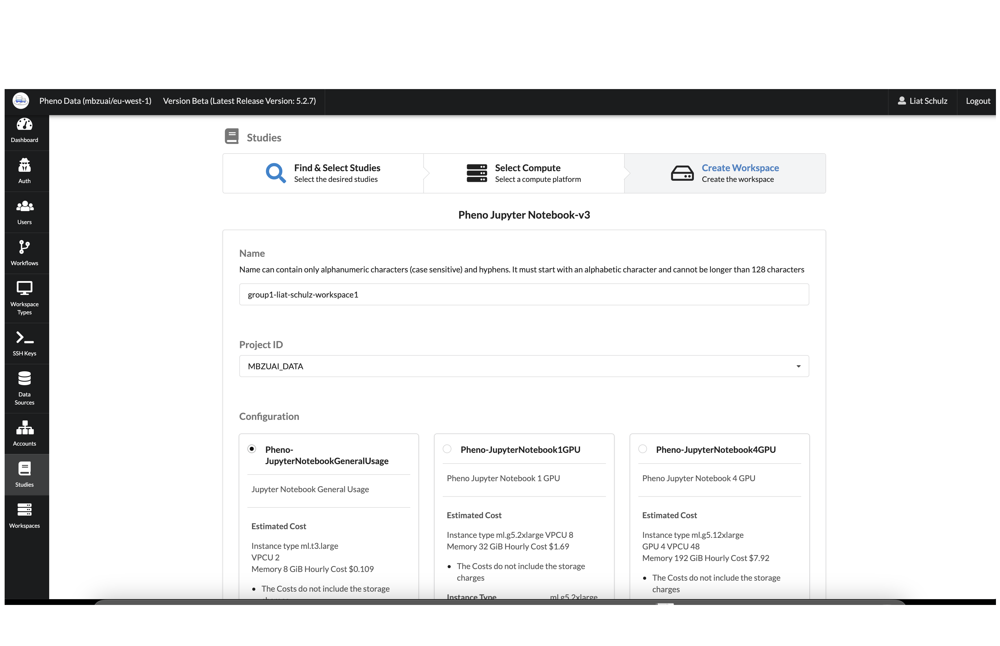

# Trusted Research Environment User Guide

Trusted Research Environment (TRE) is a cloud solution that provides secure access to data, tooling, and compute power that researchers need. Researchers can focus on achieving research missions and completing essential work in minutes in a trusted research environment.

# Getting Started

## Sign Up

Use this section if this is your first time connecting to the system.

1. Open your browser and navigate to [https://mbzuai.pheno.ai](https://mbzuai.pheno.ai)
1. Click on the **Sign up** link.

3. Fill out your **Username** (email address), **Name**, **Family name** and pick a **Password.**

4. Click the **Sign up** button.

## Login

1. Open your browser and navigate to [https://mbzuai.pheno.ai](https://mbzuai.pheno.ai)
1. Type in your **Username** (the email you used to sign up) and your **Password.**
1. Click the **Sign In** button.

## User Interface

**Dashboard** - Displays AWS charges over the past 30 days

**SSH Keys** - SSH Keys for EC2 authorization

**Studies** - Data sets saved in Amazon S3

**Workspaces** - The combination of a study with a compute

# Using Trusted Research Environment

## Launching a new Research Environment

A user can select a Study or multiple Studies and launch a Workspace to access and analyze data. To launch a Research Environment, follow these steps:

1. In the portal navigate to the **Studies** page using the menu on the left.
1. Select the Studies `MBZUAI Hackathon` and `Group {id} Shared Folder` to be attached to the new Workspace.
1. Once you have selected all the Studies you want, click the **Next** button.

4. Choose the type of Workspace you want and click the **Next** button.

5. Use this format for the Workspace **Name** field: `group{id}-{full_name}-workspace{num}`. 
    
    Example: `group3-hagai_rossman-workspace1`.

5. Select `MBZUAI_DATA` in the **Project ID** drop down field.
5. Select the **Configuration** type - `Pheno-JupyterNotebook1GPU` or `Pheno-JupyterNotebook4GPU` according to your needs.
8. Type a description for the Workspace in the **Description** field.
9. Click the **Create Research Workspace** button.

This will deploy the new Workspace and attach the Studies that were selected. 

You will automatically be redirected to the Workspaces tab on the portal.

Wait for the workspace to be **Available**.

## Connecting to an Existing Research Environment

1. In the portal navigate to the **Workspaces** page using the menu on the left.
1. Click on the **Connections** button, below the **Workspace** name.

3. Click on the **Generate URL** button on the right, under HTTP Connections.
4. Click on the **Copy icon** to copy the notebook link, and click **Connect.**

5. Wait for the system to load.

6. Click on the Apps icon on the top left, and pick **Chrome.**

7. Click the paste icon in the top menu, and paste the notebook URL you copied on **Step 4**.

8. Go to **Chrome**, right click and **Paste/Paste and go to.**

9. You can now access your Jupyter Notebook.

## Attach Files to a Research Environment

1. Navigate to the **Studies** page using the menu on the left.
1. Find the Study named `Group {id} Shared Folder` on the list and click **Upload Files** on the right.
1. You can upload files either by dragging and dropping, or by clicking the **Upload Files** or **Upload Folder** button.

## Collaborating and Sharing Data Between Environments

1. Connect to the Research Environment and open your Jupyter Notebook (See: Connect to an Existing Research Environment)
2. Click on Open JupyterLab on the top right.

3. Click on Terminal under Other.

4. Copy the files you want to share to `/efs`

All files under /efs will be available for all Research Environments under the project.

## Terminating a Research Environment

When you no longer need a Research Environment you can terminate it. Follow these steps:

1. In the portal navigate to the **Workspaces** page using the menu on the left.
1. In the list of Workspaces, find the Workspace that you want to terminate.
1. Click on the **Terminate** button, the Workspace must be in the **Ready** state to terminate it.

# Tools Installation

## Installing Python Packages

1. Connect to the Research Environment and open your Jupyter Notebook (See: Connect to an Existing Research Environment)
2. Click on Open JupyterLab on the top right.

3. Click on Terminal under Other.

4. Inside the terminal window, type `sudo -iu ec2-user` to change user.

5. Inside the terminal window, type `pip3 install <package name>` and hit Enter.

### For any questions or help please contact: [support@pheno.ai](support@pheno.ai)